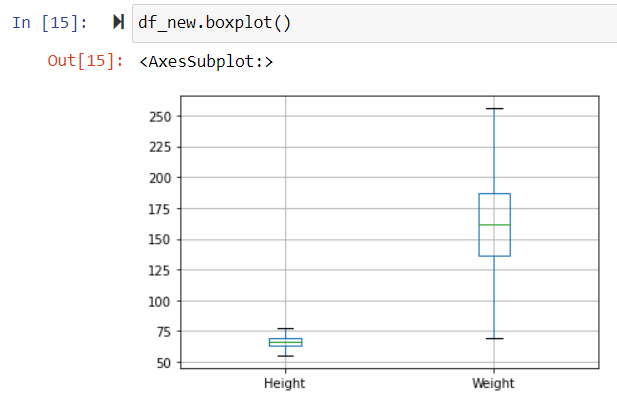

# Ex-02_DS_Outlier
# Aim:
To identify the outliers and remove it from the given data and save the final data.

# Explanation:
Outliers is a data point that differs significantly from other observations. Outliers can cause serious problems in statistical analyses.Box plot is a useful graphical dispaly,it displays outliers present in a data.

# ALGORITHM:
## STEP 1:
Import the needed packages.
## STEP 2:
Remove the non numerical columns.
## STEP 3:
Create box plot to check the outliers.
## STEP 4:
Remove the outliers by z scores and list manipulation or by using Interquartile Range(IQR).
## STEP 5:
Check if the outliers are removed from the data.
## STEP 6:
Save the final data into the file.

# PROGRAM:
```
Developed by: Meenakshi 
Register number:212221230057
#intial value
import pandas as pd 
df=pd.read_csv('weight.csv')
print(df)

#removing non numerical columns
df=df.drop("Gender",axis=1)
df

df.boxplot()

#calculating z score 
import numpy as np
from scipy import stats
z=np.abs(stats.zscore(df))
print(z)

#removing outliers [weight]
rdf=df.copy()
rdf=rdf[(z<3).all(axis=1)]
print(rdf)

rdf.boxplot()

#removing outliers[height]
dfh=df.copy()
q1=dfh.quantile(0.25)
q2=dfh.quantile(0.75)
IQR=q2-q1
df_new=dfh[((dfh>=q1-1.5*IQR)&(dfh<=q2+1.5*IQR)).all(axis=1)]
print(df_new)

df_new.boxplot()

df_new

df.to_csv('weight.csv',index=False)
```
# Output:





# Result:
Thus the outliers are detected and removed in the given file and the final data set is saved into the file.